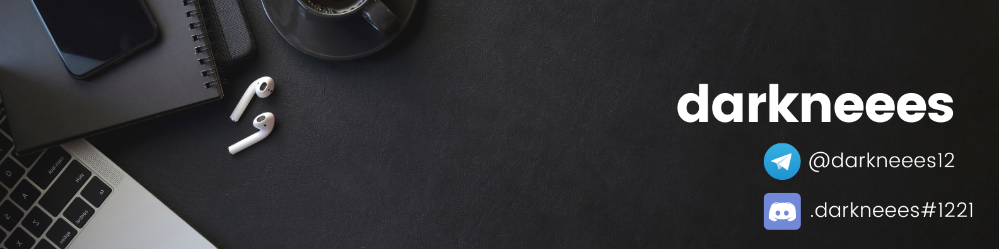

  
  <h2>Привет, меня зовут Андрей</h2>
  <h1>Я занимаюсь бэкэнд разработкой, прикладным программирование и капелькой фронтэнд</h1>  

Я люблю заниматься программирование. Писать различные прикладные и веб приложения. Иногда занимаюсь даже мобильной разработкой, если возникет такая необходимость :) Не против помочь с обучением или ответить на вопросы.

### Вы можете связаться со мной(кликабельно):

  
  

Работал(ю) со следующими языками:
  

  

Работал(ю) со следующими технологиями:

* Spring Framework (Уточняйте конкретно, фреймворк очень большой :) )
* Thymeleaf
* JavaFX
* AvaloniaUI
* Entity Framework
* MySql
* JPA
* Flask
* OpenCV
